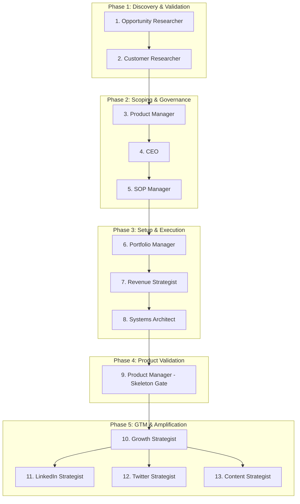

# Tool Factory Operating System (TFOS)

This repository contains the operational guidelines, templates, and Claude/Antigravity skills for running a repeatable, bootstrapped, portfolio-based holding company business that discovers, validates, builds, and grows software assets under a single umbrella brand (**TMaker**).

## Repository Layout
- **`vision/`**: High-level vision statement detailing bootstrapped, profit-first principles.
- **`principles/`**: Core operational principles and E-myth rules (e.g. Federer's 54% rule).
- **`opportunity-engine/`**: social listening, validation templates (Week 1 leads gate), and build-reject framework.
- **`product-engine/`**: 30-day build limits, single-workflow PRD specs, and Month 2 skeleton gates.
- **`growth-engine/`**: LinkedIn/X daily posting, GTM plans, Rewardful affiliates, and vertical video cross-posting.
- **`revenue-engine/`**: B2B pricing bands ($40-$100/mo), credit card gated trials, and customer expansion holding company guidelines.
- **`operations-engine/`**: SOP markdown standards, wiki index layout, and co-founder contract templates.
- **`leadership-engine/`**: Monday metrics, keep/kill monthly reviews, and annual face-to-face retreat planner.
- **`ai-workforce/`**: The 12 specialized skills containing proper YAML frontmatter.

---

## AI Workforce Skills Execution Sequence

To take a software product from initial idea to scaling under the holding company umbrella, execute the 12 AI workforce skills in this exact sequential order:

### Phase 1: Discovery & Validation
1. **`opportunity-researcher`**: Scrapes forums for customer pain points and scores them (target score $\ge 40$ in scoring framework).
2. **`customer-researcher`**: Runs the **Week 1 Validation Gate** (checks for $\ge 10$ unprompted leads via pitches within 7 days).

### Phase 2: Scoping & Governance
3. **`product-manager`**: Drafts the single-workflow MVP spec and PRD template (AI modular wrapper & non-AI moat).
4. **`ceo`**: Evaluates the Build vs Reject decision tree, checks active MVP limits, and signs off.
5. **`sop-manager`**: Drafts or updates any project-specific operating procedures.

### Phase 3: Setup & Execution
6. **`portfolio-manager`**: Allocates resources and assigns the project to a co-founder builder under the TMaker project agreement (no salary, equity-only profit split).
7. **`revenue-strategist`**: Audits pricing to ensure it sits within the B2B band ($40-$100/mo) and ensures credit cards are required for trials.
8. **`systems-architect`**: Connects tracking APIs (PostHog, Rewardful, Stripe) and standardizes configurations.

### Phase 4: Product Validation
9. **`product-manager`**: Enforces the **Month 2 Skeleton Gate** (freezes feature additions unless at least 5 testers run the core workflow at least twice in Month 2).

### Phase 5: GTM & Amplification
10. **`growth-strategist`**: Coordinates the launch and starts the **60-day concurrent GTM channel test** (kills the worst two, doubles down on the winner).
11. **`linkedin-strategist`**: Builds organic distribution via daily build-in-public posts.
12. **`twitter-strategist`**: Drafts X threads, monitors discussions, and runs warm DMs.
13. **`content-strategist`**: Repurposes video clips across social channels.

---

## Loading Skills into Antigravity
To load these skills into your Antigravity or Claude agent:
1. Open settings or configure your provider's skill path to point to `tool-factory-os/ai-workforce/[role]`.
2. Ensure the skill is enabled. The YAML frontmatter in each `SKILL.md` defines the trigger conditions for loading.
