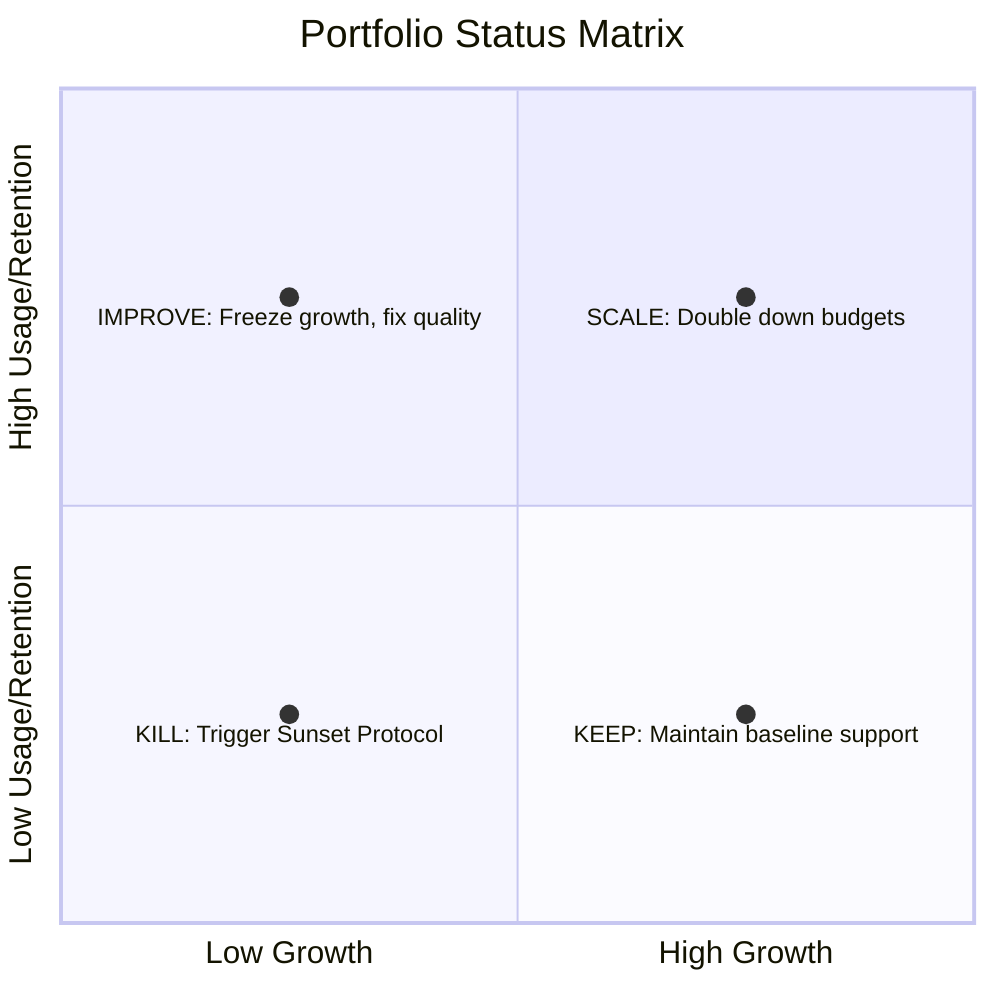

# Leadership Engine - Monthly Portfolio Review SOP

## 1. Trigger
Executed by the **CEO** and **Portfolio Manager** on the first day of each calendar month.

## 2. The Status Matrix Audit
Review every product in the portfolio and classify it into one of four categories:

### Classification Rules:
- **SCALE**: High growth (MRR expanding >15%/mo) and high retention (churn <8%).
  - *Action*: Double down on marketing budgets. Move co-founder engineering time from other projects to scale infrastructure.
- **IMPROVE**: Low growth but high retention (users love it, but we aren't acquiring).
  - *Action*: Run A/B testing on landing page headlines and CTA copy. Revise the warm DM outreach campaigns.
- **KEEP**: Low growth and moderate retention (stable baseline revenue, minimal maintenance required).
  - *Action*: Maintain baseline support, do not write new features, and redirect developer bandwidth to new MVPs.
- **KILL**: Low growth and high churn (>12% cohort churn) or failed Month 2 skeleton gates.
  - *Action*: Execute the Sunset Protocol immediately.

## 3. The 60-Day GTM Channel Audit
For all projects in the Scale phase:
- Verify if they have completed the 60-day concurrent channel test.
- Confirm that the two worst marketing channels have been killed and the winner is receiving 100% of the growth focus.
